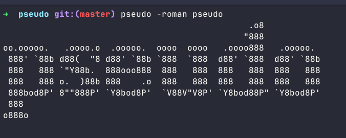

# pseudo

A CLI tool that renders text as ASCII art in your terminal.



## Install

```bash
pip install .
```

This installs `pseudo` globally — available in every terminal session.

## Use

```bash
pseudo hello              # renders "hello" in roman style
pseudo -roman hello       # same as above (explicit style)
pseudo -styles            # lists all available styles
```

## Extend

Add more styles by extending `pyproject.toml` dependencies or the style registry in `pseudo/cli.py`.
